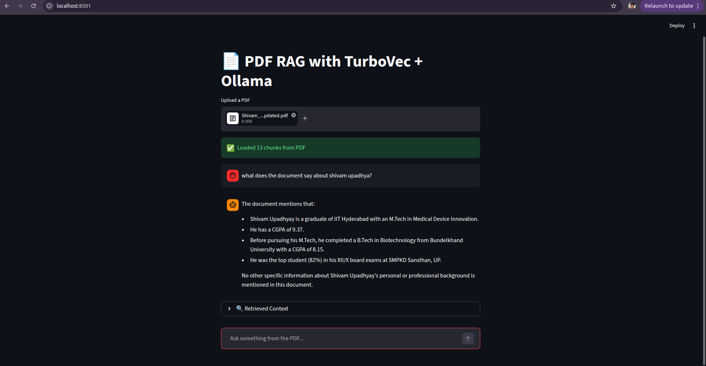

## Demo


# 🚀 Local PDF RAG System with TurboVec + Ollama

A fully local Retrieval-Augmented Generation (RAG) system that allows you to upload PDFs and query them using an LLM — without any external APIs.

## 📁 Project Structure

```
local-pdf-rag-turbovec-ollama/
│── app.py              # Streamlit UI (chat interface)
│── rag.py              # Core RAG pipeline (retrieval + generation)
│── indexer.py          # Builds vector index
│── index.py            # Legacy / testing script
│── query.py            # CLI-based querying (optional)
│── requirements.txt    # Dependencies
│── README.md           # Project documentation
│── demo.png            # Demo screenshot
│── data/               # Input documents (PDF/text)
│── index/              # Stored vector index
│── .gitignore
```

---

## ✨ Overview

This project implements a fully local Retrieval-Augmented Generation (RAG) system that allows users to upload PDFs and query them using a Large Language Model (LLM).

Unlike typical RAG systems that rely on cloud APIs, this pipeline runs completely offline, ensuring privacy, control, and cost efficiency.

---

## 🧠 Why this project?

Most RAG implementations:

* depend on external APIs
* use standard vector search (FAISS)

This project explores:

* ⚡ TurboVec (TurboQuant) for efficient vector search
* 🔒 Fully local LLM inference using Ollama
* 🔍 Source-grounded answers with citations

---
## 🧠 Design Decisions

### 1. Why TurboVec instead of FAISS?

TurboVec uses TurboQuant compression, which significantly reduces memory usage while maintaining high recall. This makes it suitable for efficient local deployments.

---

### 2. Why Local LLM (Ollama)?

* Ensures data privacy
* No dependency on external APIs
* Lower cost for repeated queries

---

### 3. Why Chunking with Overlap?

Naive chunking breaks context and reduces retrieval quality.
Overlap ensures semantic continuity and improves answer accuracy.

---

### 4. Why Strict Prompting?

LLMs tend to hallucinate when context is incomplete.
Strict prompting ensures:

* grounded answers
* reduced hallucination
* predictable outputs

---

### 5. Why Citation-Based Answers?

Adding source references:

* improves trust
* makes answers verifiable
* aligns with real-world RAG systems


## 🏗️ Architecture

```
User Upload PDF
      ↓
Text Extraction (pypdf)
      ↓
Chunking (overlap)
      ↓
Embeddings (Sentence Transformers)
      ↓
TurboVec Index (TurboQuant)
      ↓
Query Embedding
      ↓
Top-K Retrieval
      ↓
Context Construction
      ↓
LLM (Ollama)
      ↓
Answer with Citations
```

---

## 🔍 System Flow

1. User uploads a PDF
2. Text is extracted
3. Text is split into chunks
4. Chunks are converted into embeddings
5. TurboVec stores vectors
6. Query is embedded and matched
7. Relevant chunks are retrieved
8. LLM generates answer
9. Response includes citations

---

## 🚀 Features

* 📄 PDF upload and querying
* ⚡ Fast vector search using TurboVec
* 🧠 Local LLM inference via Ollama
* 🔍 Citation-based answers
* 🔒 Fully offline
* 💬 Chat-style interface

---

## ⚙️ Setup

```bash
git clone https://github.com/Upshivam786/local-pdf-rag-turbovec-ollama.git
cd local-pdf-rag-turbovec-ollama
pip install -r requirements.txt
ollama pull llama3.2
ollama serve
streamlit run app.py
```

---

## 💡 Example

**Question:**
What does the document say about models?

**Answer:**
Model selection is a cost structure decision...

**Sources:**
[0] Model selection is a cost structure...
[1] Scaling issues occur with wrong model choice...

---

## 🧠 Key Learnings

* RAG quality depends more on retrieval than model
* Chunking impacts performance heavily
* Strict prompting reduces hallucination
* Local pipelines improve privacy

---

## 🔧 Tech Stack

* Python
* TurboVec
* Sentence Transformers
* Ollama
* Streamlit

---

## 🚀 Future Improvements

* PDF highlighting
* Hybrid search
* Multi-document support

---

## 🙌 Author

**Shivam Upadhyay**
